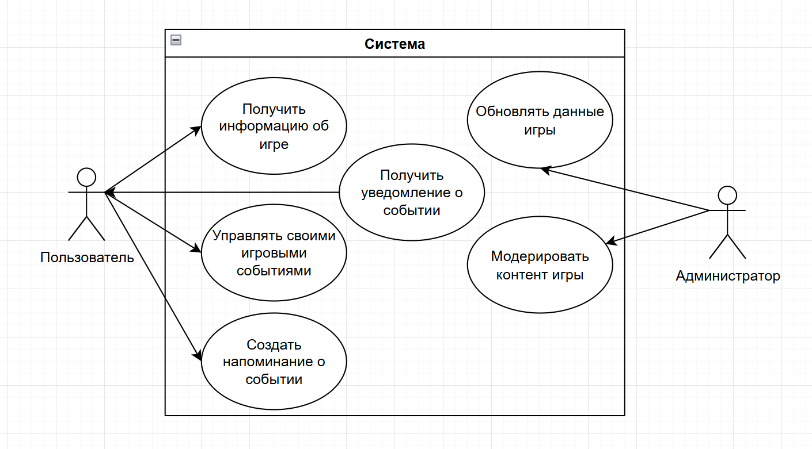

# BUC-диаграмма (Business Use Case)

## Назначение

Диаграмма бизнес-прецедентов показывает, **какие бизнес-действия система должна поддерживать** на уровне бизнес-контекста — без погружения в детали реализации. Отвечает на вопрос: *«Что должен уметь делать бизнес с помощью системы?»*

---

## Бизнес-акторы

| Актор | Роль | Описание |
|-------|------|---------|
| **Пользователь** | Конечный пользователь | Игрок LDOE, использующий приложение для получения информации и управления событиями |
| **Администратор** | Модератор | Управляет информационной базой: добавляет, редактирует, удаляет игровой контент |

---

## Бизнес-прецеденты

| ID | Бизнес-прецедент | Актор | Описание |
|----|-----------------|-------|---------|
| BUC-001 | Получение информации об игре | Пользователь | Просмотр базы данных игровых объектов: локации, ресурсы, механики крафта |
| BUC-002 | Управление своими игровыми событиями | Пользователь | Создание, редактирование, удаление персональных таймеров-напоминаний |
| BUC-003 | Создание напоминания о событии | Пользователь | Настройка уведомления с привязкой к игровому шаблону и времени срабатывания |
| BUC-004 | Получение уведомления о событии | Пользователь | Получение push-уведомления при истечении таймера события |
| BUC-005 | Обновление данных игры | Администратор | Добавление и редактирование записей в информационной базе |
| BUC-006 | Модерирование контента | Администратор | Проверка пользовательских шаблонов событий и управление ими |

## Диаграмма

---

## Связь с системными Use Case

| Бизнес-прецедент | Системные UC |
|-----------------|-------------|
| BUC-001 Получение информации | UC-001 Поиск контента, UC-002 Просмотр деталей |
| BUC-002 Управление событиями | UC-003 Создание события, UC-004 Редактирование события, UC-005 Удаление события |
| BUC-003 Создание напоминания | UC-003 Создание события |
| BUC-004 Получение уведомления | UC-006 Получение push-уведомления |
| BUC-005 Обновление данных | UC-007 Добавление контента (Admin) |
| BUC-006 Модерирование контента | UC-008 Редактирование контента (Admin), UC-009 Удаление контента (Admin) |
