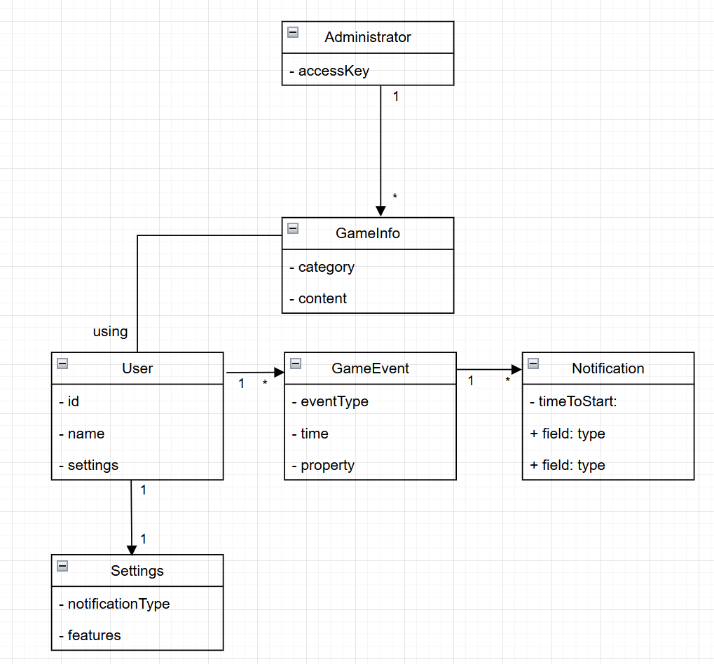

# Модель бизнес-классов

## Описание

Модель бизнес-классов — диаграмма предметной области проекта, описывающая ключевые сущности (бизнес-объекты) системы, их назначение и структурные связи. Служит концептуальной основой для формирования доменной модели, схемы базы данных и архитектурных решений. Позволяет убедиться, что все участники команды и заказчик используют единое понимание предметной области.

---

## Ключевые сущности

| Сущность | Описание |
|---------|---------|
| **User** | Зарегистрированный пользователь системы |
| **Settings** | Персональные настройки уведомлений и интерфейса пользователя |
| **Administrator** | Модератор информационной базы; наследует User с расширенными правами |
| **GameInfo** | Единица игровой информации — объект, механика или локация из LDOE |
| **GameEvent** | Пользовательское игровое событие с привязанным таймером |
| **Notification** | Уведомление, генерируемое при срабатывании таймера GameEvent |

---

## Диаграмма

---

## Связи между сущностями

| Связь | Тип | Описание |
|-------|-----|---------|
| User → Settings | 1:1 | Каждый пользователь имеет одну запись персональных настроек |
| User → GameEvent | 1:N | Пользователь может создавать неограниченное количество событий |
| GameEvent → Notification | 1:N | Событие порождает уведомления при каждом срабатывании таймера |
| Administrator → GameInfo | 1:N | Администратор управляет записями информационной базы |
| GameInfo → GameEvent | N:M | Событие может быть привязано к игровому шаблону из базы GameInfo |
