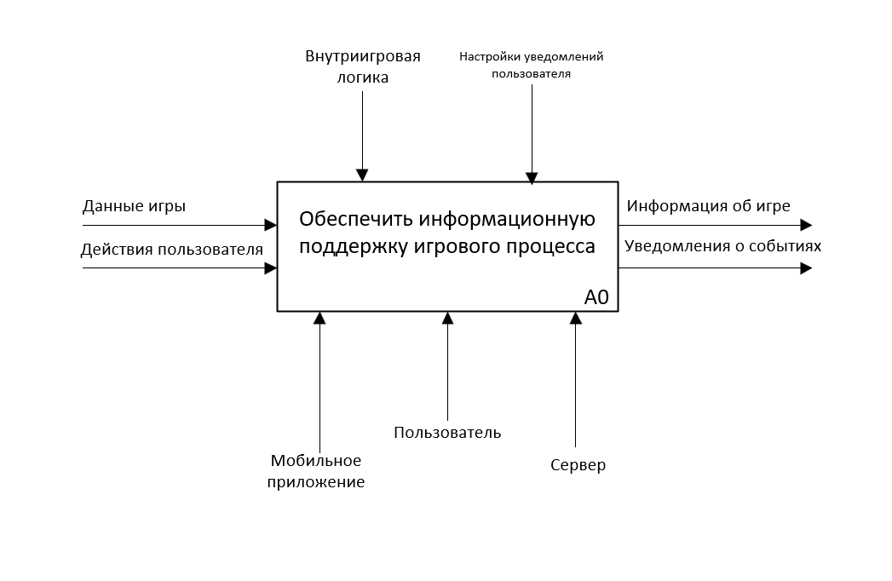
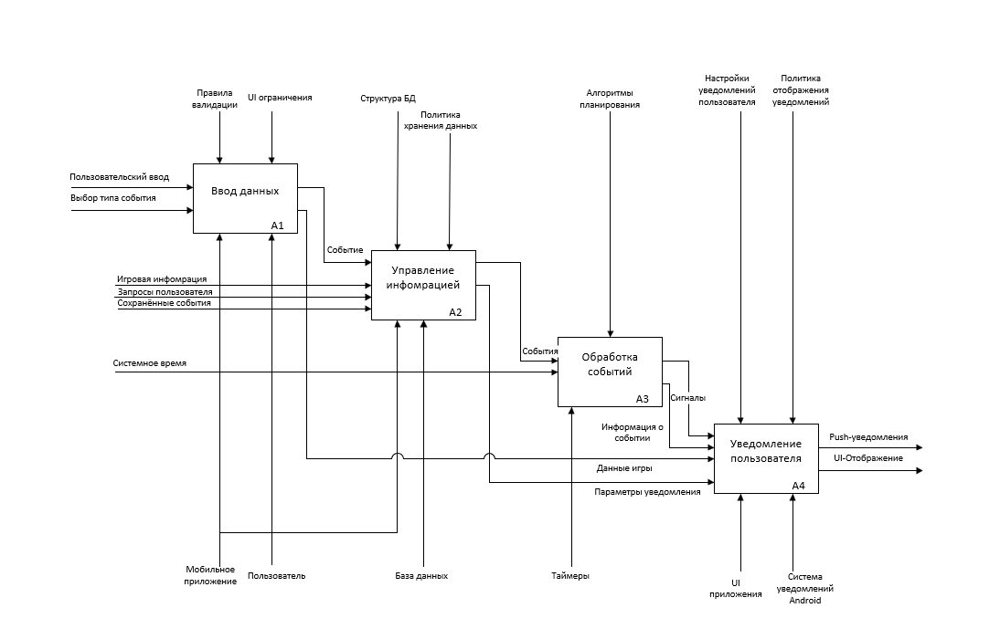

# Context-diagram IDEF0

Назначение - показать систему как единый функциональный блок в бизнес-окружении.

Элементы диаграммы (А-0):
- Основная функция (А0): "Обеспечить информационную поддержку игрового процесса"
- Входы(Inputs):
    - Данные игры
    - Действия пользователя
- Выходы(Outputs):
    - Инфомрация об игре
    - Уведомления о событиях
- Управление(Controls):
    - Внутриигровая логика
    - Настройки уведомлений пользователя
- Механизмы(Mechanisms):
    - Мобильное приложение
    - Пользователь
    - Сервер

Эта диаграмма даёт общее представление о системе. Но для того чтобы получить более конкретное представление нужно провести декомпозицию.

Основные функции (A1-A4):
- Ввод данных
- Управление информацией
- Обработка событий
- Уведомление пользователя

