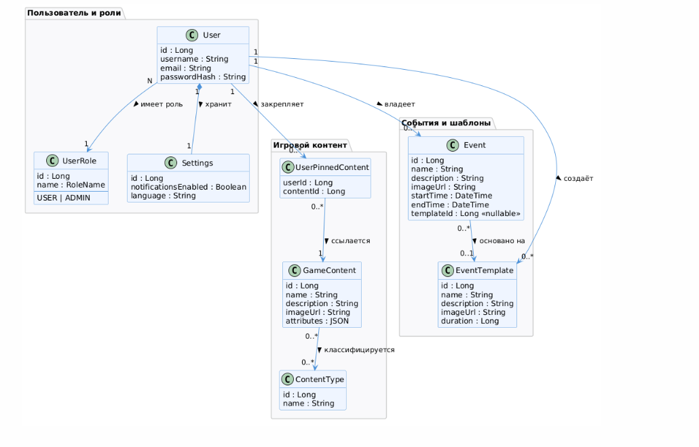

# Доменная модель

## Описание

Доменная модель — структурное представление ключевых понятий предметной области и их отношений. В отличие от диаграммы классов, доменная модель описывает концепции реального мира, а не программные классы. Служит основой для проектирования схемы базы данных и архитектуры системы.

---

## Ключевые сущности

| Сущность | Таблица БД | Описание | Ключевые атрибуты |
|---------|-----------|---------|-----------------|
| **User** | `users` | Зарегистрированный пользователь системы | id, username, email, passwordHash |
| **UserRole** | `user_roles` | Роль пользователя, определяющая набор прав | id, name (`USER` / `ADMIN`) |
| **Settings** | `settings` | Персональные настройки уведомлений и интерфейса | id, userId, notificationsEnabled, language |
| **GameContent** | `game_content` | Единица игровой информации (объект, механика, локация) | id, name, description, imageUrl, attributes (JSON) |
| **ContentType** | `content_types` | Классификатор типа игрового контента | id, name |
| **EventTemplate** | `event_template` | Повторно используемый шаблон события с заданной длительностью | id, creatorId, name, description, imageUrl, duration |
| **Event** | `events` | Пользовательское игровое событие с интервалом времени | id, userId, templateId (nullable), name, description, imageUrl, startTime, endTime |

---

## Сущности-связи

| Сущность | Таблица БД | Описание |
|---------|-----------|---------|
| **UserPinnedContent** | `user_pinned_content` | Закреплённые пользователем единицы контента (составной PK: userId + contentId) |
| *(type_to_content)* | `type_to_content` | Связь GameContent ↔ ContentType (M:N, без отдельной Java-сущности) |

---

## Диаграмма

---

## Отношения между сущностями

| Связь | Тип | Описание |
|-------|-----|---------|
| User → UserRole | N:1 | У пользователя одна роль; роль может быть у многих пользователей |
| User → Settings | 1:1 | Каждому пользователю соответствует одна запись настроек |
| User → Event | 1:N | Пользователь владеет неограниченным числом событий |
| User → EventTemplate | 1:N | Пользователь создаёт собственные шаблоны событий |
| Event → EventTemplate | N:1 | Событие опционально основано на шаблоне (при удалении шаблона поле обнуляется) |
| GameContent → ContentType | M:N | Один объект контента может принадлежать нескольким типам |
| User ↔ GameContent | M:N | Через `UserPinnedContent`: пользователь закрепляет произвольное число объектов |

---

## Связь с бизнес-классами

Доменная модель детализирует [модель бизнес-классов](../00-project-charter/business-classes.md):
`GameInfo` → `GameContent + ContentType`, `GameEvent` → `Event + EventTemplate`, `Administrator` → `User с ролью ADMIN`.
