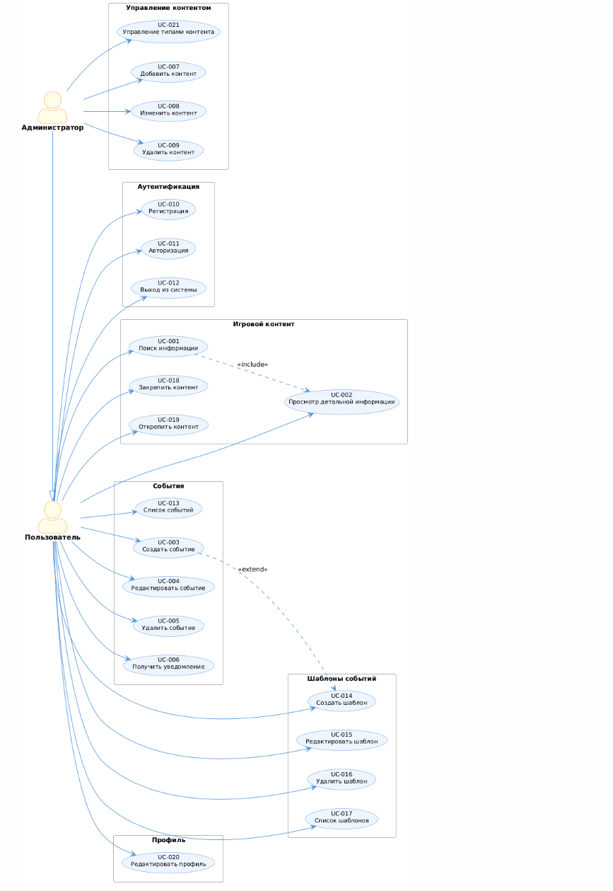

# Use Case диаграмма

## Описание

Use Case диаграмма показывает функциональность системы с точки зрения пользователей. Определяет акторов (роли), набор системных прецедентов (UC) и связи между ними. Отвечает на вопрос: *«Что система должна уметь делать для каждой роли?»*

---

## Акторы

| Актор | Описание |
|-------|---------|
| **Пользователь** | Зарегистрированный игрок LDOE, использующий приложение для получения информации и управления событиями |
| **Администратор** | Привилегированный пользователь с правом управления игровым контентом в базе данных |

---

## Прецеденты — Аутентификация (общие)

| ID | Use Case | Актор |
|----|---------|-------|
| UC-010 | Регистрация | Пользователь |
| UC-011 | Авторизация | Пользователь / Администратор |
| UC-012 | Выход из системы | Пользователь / Администратор |

---

## Прецеденты пользователя — Игровой контент

| ID | Use Case | Описание |
|----|---------|---------|
| UC-001 | Поиск информации | Поиск игровых объектов по названию или типу |
| UC-002 | Просмотр детальной информации | Просмотр полного описания игрового объекта |
| UC-018 | Закрепить контент | Добавить игровой объект в список закреплённых |
| UC-019 | Открепить контент | Убрать игровой объект из списка закреплённых |

---

## Прецеденты пользователя — События

| ID | Use Case | Описание |
|----|---------|---------|
| UC-013 | Посмотреть список событий | Просмотр всех активных пользовательских событий |
| UC-003 | Создать событие | Создание нового события с таймером (опционально — на основе шаблона) |
| UC-004 | Редактировать событие | Изменение параметров существующего события |
| UC-005 | Удалить событие | Удаление события и его таймера |
| UC-006 | Получить уведомление | Получение push-уведомления при срабатывании таймера |

---

## Прецеденты пользователя — Шаблоны событий

| ID | Use Case | Описание |
|----|---------|---------|
| UC-017 | Посмотреть список шаблонов | Просмотр личных шаблонов событий |
| UC-014 | Создать шаблон | Создание повторно используемого шаблона события с именем и длительностью |
| UC-015 | Редактировать шаблон | Изменение параметров существующего шаблона |
| UC-016 | Удалить шаблон | Удаление пользовательского шаблона |

---

## Прецеденты пользователя — Профиль

| ID | Use Case | Описание |
|----|---------|---------|
| UC-020 | Редактировать профиль | Изменение имени пользователя или email |

---

## Прецеденты администратора — Контент

| ID | Use Case | Описание |
|----|---------|---------|
| UC-007 | Добавить контент | Добавление новой записи в информационную базу |
| UC-008 | Изменить контент | Редактирование существующей записи |
| UC-009 | Удалить контент | Удаление записи из информационной базы |
| UC-021 | Управление типами контента | Создание и удаление типов игрового контента |

---

## Диаграмма

