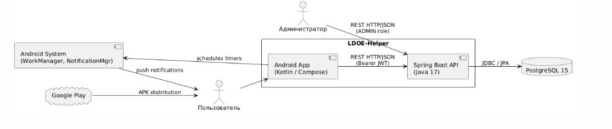
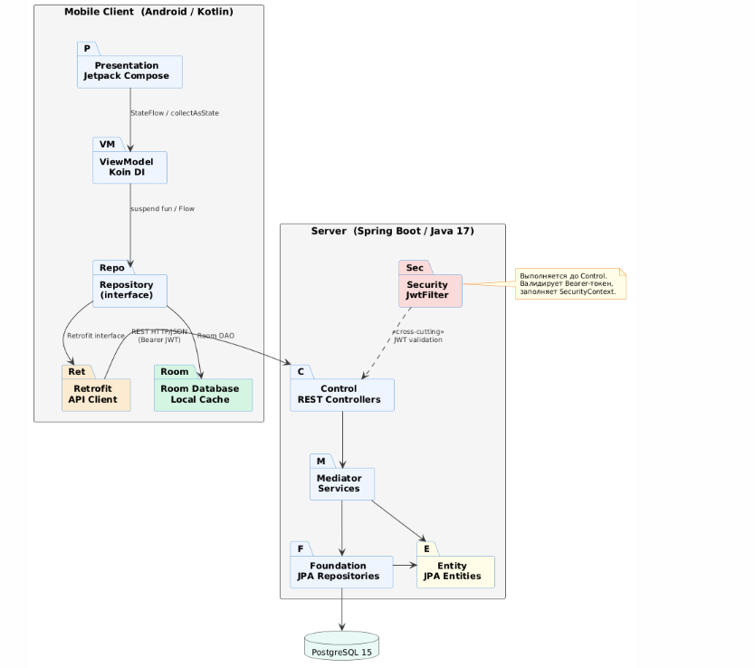
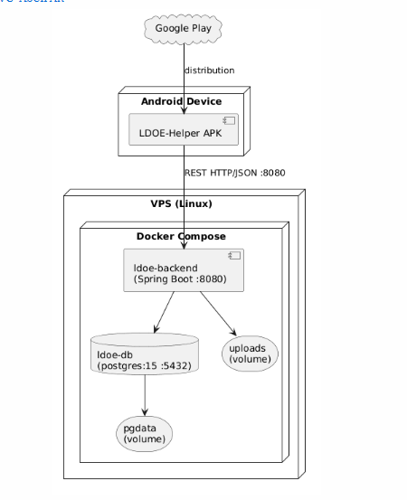

# Архитектурный документ (Arc42)

Проект: **LDOE-Helper**  
Траектория: Mobile  
Версия: 1.0  
Дата: 29.05.2026  
Автор: Черников Дмитрий Дмитриевич

---

## 1. Введение и цели

### 1.1. Краткое описание системы

**LDOE-Helper** — Android-приложение для игроков *Last Day on Earth: Survival*. Значительная часть игровой информации недоступна внутри игры и не поддаётся систематизации штатными средствами. Приложение решает эту проблему, предоставляя структурированный справочник по механикам, локациям, ресурсам и рецептам крафта.

Вторая задача системы — управление временными событиями. Игровые процессы (откат локаций, завершение крафта, восстановление энергии) требуют отслеживания в реальном времени. Приложение предоставляет конструктор персональных таймеров с push-уведомлениями и overlay-виджетом, отображаемым поверх запущенной игры.

Система состоит из двух компонентов: мобильного Android-клиента (Kotlin, Jetpack Compose) и серверного REST API (Java 17, Spring Boot 4.0.6) с базой данных PostgreSQL 15.

### 1.2. Цели архитектуры

| Цель | Описание |
|------|---------|
| Разделение ответственности | Чёткое разделение UI, бизнес-логики и доступа к данным через PCMEF |
| Offline-доступность | Приложение работает без сети за счёт Room-кэша |
| Тестируемость | Каждый слой тестируется изолированно через mock-зависимости |
| Масштабируемость | Добавление новых типов контента без изменения схемы БД (JSONB) |
| Безопасность | Stateless JWT-аутентификация с ролевым разграничением доступа |
| Надёжность уведомлений | WorkManager гарантирует доставку уведомлений даже при убитом процессе |

### 1.3. Стейкхолдеры

| Стейкхолдер | Интересы |
|------------|---------|
| Игрок | Стабильное приложение, актуальные данные, своевременные push-уведомления |
| Администратор | Надёжный и документированный API для управления игровым контентом |
| Заказчик | Соответствие функциональным требованиям, работоспособность системы |

---

## 2. Ограничения

### 2.1. Технические ограничения

| Ограничение | Значение |
|------------|---------|
| Мобильная платформа | Android 10+ (SDK 29+) — требование overlay-разрешения `SYSTEM_ALERT_WINDOW` |
| Язык серверной части | Java 17 |
| Фреймворк | Spring Boot 4.0.6 |
| База данных | PostgreSQL 15 (необходим JSONB для гибких атрибутов контента) |
| Клиент | Android (Kotlin, Jetpack Compose) |
| Управление схемой | `ddl-auto=update`; в production требует замены на Flyway/Liquibase |
| Хранение изображений | Локальная файловая система в Docker-томе `/uploads` |
| Источник данных | Нет официального API LDOE — данные вносятся вручную администратором |

### 2.2. Бизнес-ограничения

| Ограничение | Значение |
|------------|---------|
| Бюджет | VPS ~500 руб./мес., без платных облачных сервисов |
| Сроки | Плановый дедлайн первого релиза — 29.05.2026 |
| Команда | 1 разработчик |
| Правовые | Только fan-made данные; официальные игровые ассеты не используются (IP Кефир) |

---

## 3. Контекст системы

### 3.1. Бизнес-контекст

Функциональная модель системы описана в документе IDEF0:  
[`00-project-charter/idef0.md`](../00-project-charter/idef0.md)

Краткая справка:  
Основная функция системы — **обеспечить информационную поддержку игрового процесса**.  
Входы: игровые данные (контент, механики, локации), действия пользователя (запросы, создание событий).  
Выходы: структурированная информация об игре, уведомления о событиях.

### 3.2. Технический контекст





| Интерфейс | Тип | Направление |
|-----------|-----|------------|
| `/auth`, `/events`, `/content`, `/templates`, `/users` | REST HTTP/JSON | Android App → Backend |
| `/images/**` | HTTP GET (публично) | Android App → Backend |
| Push-уведомления | Android NotificationManager | WorkManager → Android System |
| Дистрибуция APK | Google Play | → Пользователь |

---

## 4. Стратегии

### 4.1. Стратегия декомпозиции

Система декомпозирована по слоям архитектурного паттерна **PCMEF** в клиент-серверной адаптации.

Детали выбора и альтернативы: [`02-architecture/adr/adr-001.md`](adr/adr-001.md)

| Слой | Расположение | Ответственность |
|------|-------------|----------------|
| Presentation (P) | Android (Jetpack Compose) | UI, отображение, ввод данных |
| State Management | Android (ViewModel / Koin) | Состояние экранов, бизнес-логика клиента |
| Repository | Android | Абстракция над Room и Retrofit |
| Control (C) | Spring Boot | REST API, валидация DTO |
| Mediator (M) | Spring Boot | Бизнес-логика, транзакции |
| Entity (E) | Spring Boot | JPA-сущности предметной области |
| Foundation (F) | Spring Boot | Репозитории, доступ к данным |

Полная диаграмма пакетов: [`02-architecture/pcmef-diagram.md`](pcmef-diagram.md)

### 4.2. Стратегия управления данными

- Серверная СУБД: PostgreSQL 15, ORM через Spring Data JPA
- Транзакции управляются через `@Transactional` на уровне Mediator
- JSONB-атрибуты в `game_content.attributes` — гибкая схема без миграций для разнородного контента
- Клиентский кэш: Room Database с offline-first стратегией (подробнее: [`adr/adr-004.md`](adr/adr-004.md))
- При наличии сети: fetch → upsert в Room (`OnConflictStrategy.REPLACE`, «сервер побеждает»)

### 4.3. Стратегия безопасности

Детали стратегии аутентификации: [`02-architecture/adr/adr-003.md`](adr/adr-003.md)

- Аутентификация: stateless JWT (access-токен 20 мин + refresh-токен 7 дней)
- Хеширование паролей: BCrypt
- Роли: `ROLE_USER`, `ROLE_ADMIN`
- Авторизация: `@PreAuthorize("hasRole('ADMIN')")` на admin-эндпоинтах
- `JwtFilter` выполняется до попадания запроса в Controller, заполняет `SecurityContext`
- `RefreshToken` хранится в БД; при logout удаляется (инвалидация сессии)

---

## 5. Вид компонентов (структура)

### 5.1. Диаграмма пакетов PCMEF

Подробное описание: [`02-architecture/pcmef-diagram.md`](pcmef-diagram.md)  
PlantUML-исходник: [`02-architecture/code-diagram/pcmef-diagram.puml`](code-diagram/pcmef-diagram.puml)



### 5.2. Интерфейсы между слоями

Полная спецификация: [`02-architecture/interfaces.md`](interfaces.md)  
PlantUML-исходник: [`02-architecture/code-diagram/dependency-diagram.puml`](code-diagram/dependency-diagram.puml)

Control → Mediator (конструкторное DI, Spring):
```java
// EventController зависит от EventService напрямую
@RestController
public class EventController {
    private final EventService eventService;
    public EventController(EventService eventService) { ... }
}
```

Mediator → Foundation (`JpaRepository<Entity, ID>`):
```java
public interface EventRepository extends JpaRepository<Event, Long> {
    List<Event> findByUserUsername(String username);
}
```

ViewModel → Repository (Kotlin interface):
```kotlin
interface EventRepository {
    suspend fun getEvents(): Flow<List<EventUi>>
    suspend fun create(request: EventCreateRequest): Result<EventUi>
    suspend fun delete(id: Long): Result<Unit>
}
```

---

## 6. Вид выполнения (сценарии)

Подробные диаграммы последовательности:  
[`04-detailed-design/sequence-diagrams.md`](../04-detailed-design/sequence-diagrams.md)

**Сценарий 1: Поиск контента (online)**

```
Compose Screen → ViewModel → Repository → Retrofit → Controller → Service → Repository → DB
     ↑                                        ↓
     └────────────── Flow<List> (Room upsert) ─┘
```

1. Пользователь вводит запрос на экране
2. ViewModel вызывает `getContent(query)` через Repository
3. Repository отправляет `GET /content` с JWT-токеном
4. GameContentController делегирует в GameContentService
5. Сервис обращается к БД, возвращает список DTO
6. Repository сохраняет результат в Room (`upsert`)
7. UI обновляется через `StateFlow`

**Сценарий 2: Срабатывание таймера события (background)**

```
WorkManager → EventWorker → Room DAO → EventEntity
                         → NotificationManager → Android Notification Tray
```

1. WorkManager запускает `EventWorker` по расписанию
2. Worker читает данные события из Room
3. `NotificationManager` отображает push-уведомление
4. Статус события обновляется в Room

---

## 7. Вид развёртывания

### 7.1. Диаграмма развёртывания



| Сервис | Image | Порт | Volume |
|--------|-------|------|--------|
| `ldoe-db` | `postgres:15-alpine` | 5432 | `pgdata` |
| `ldoe-backend` | custom Dockerfile | 8080 | `uploads` |

Healthcheck на `ldoe-db` гарантирует запуск бэкенда только после готовности PostgreSQL.  
Конфигурация передаётся через `.env` (переменные `DB_*`, `JWT_*`, `SERVER_PORT`).

### 7.2. Инструкция по развёртыванию

Полная инструкция: [`10-deployment/installation-guide.md`](../10-deployment/installation-guide.md)

```bash
# Клонирование и запуск
git clone https://github.com/username/ldoe-helper.git
cd ldoe-helper
cp .env.example .env          # заполнить переменные окружения
docker-compose up -d
```

---

## 8. Скрещенные концепции

### 8.1. Безопасность

- Все эндпоинты кроме `/auth/**` и `/images/**` защищены JWT
- `SessionCreationPolicy.STATELESS` — сервер не хранит сессии
- Роли: `ROLE_USER`, `ROLE_ADMIN`; проверка через `@PreAuthorize`
- Access-токен: 20 мин; Refresh-токен: 7 дней, хранится в таблице `refresh_tokens`
- При logout `RefreshToken` удаляется из БД (инвалидация)

### 8.2. Транзакции

- `@Transactional` применяется на уровне Mediator (сервисы)
- Репозитории Spring Data транзакционны по умолчанию
- Контроллеры транзакций не содержат
- Уровень изоляции: `READ_COMMITTED` (PostgreSQL по умолчанию)

### 8.3. Хранение изображений

- Загрузка через `multipart/form-data` (max 5 MB, настройка в `application.properties`)
- `ImageStorageService` сохраняет файл как `uploads/{uuid}.{ext}`
- Отдача через Spring static resources: `GET /images/{filename}` — публичный эндпоинт
- В Docker Compose: именованный том `uploads`, смонтированный в `/app/uploads`

### 8.4. Обработка ошибок

- Сервер: стандартные HTTP-коды — 400 (валидация), 401 (не аутентифицирован), 403 (нет прав), 404 (не найдено), 500 (серверная ошибка)
- Клиент: `Result<T>` — обёртка над ответом Retrofit; ошибки отображаются через `Snackbar` / диалог

---

## 9. Архитектурные решения (ADR)

Все ADR находятся в папке: [`02-architecture/adr/`](adr/)

| № | Название | Статус |
|---|---------|--------|
| [ADR-001](adr/adr-001.md) | Выбор архитектурного паттерна (PCMEF) | Принято |
| [ADR-002](adr/adr-002.md) | Выбор СУБД (PostgreSQL) | Принято |
| [ADR-003](adr/adr-003.md) | Выбор механизма аутентификации (JWT) | Принято |
| [ADR-004](adr/adr-004.md) | Стратегия offline-first (Room) | Принято |
| [ADR-005](adr/adr-005.md) | Контейнеризация (Docker Compose) | Принято |

---

## 10. Качество

| Атрибут | Целевое значение | Способ проверки |
|---------|----------------|----------------|
| Offline-доступность | Работа без сети: справочник и события | Ручное тестирование (отключение сети) |
| Надёжность уведомлений | Уведомление приходит даже при убитом процессе | WorkManager instrumented test |
| Безопасность | Пользователь A не читает данные пользователя B | REST API integration test (401/403) |
| Производительность | Поиск по 500+ объектам < 500 мс | Postman / JMeter |
| Покрытие тестами | ≥ 40% по строкам | JaCoCo |
| Масштабируемость данных | Новый тип контента без DDL-миграции | Ручное тестирование через API |

---

## 11. Риски

| Риск | Влияние | Вероятность | Меры |
|------|--------|------------|------|
| `ddl-auto=update` в production | Потеря данных при конфликте схемы | Средняя | Заменить на `validate` + Flyway до production-деплоя |
| Изображения на локальной ФС | Потеря при пересоздании тома | Низкая | Том `uploads` смонтирован; при масштабировании — переход на S3 |
| Refresh-токен без TTL-очистки | Рост таблицы `refresh_tokens` | Низкая | Добавить `@Scheduled` job для удаления просроченных записей |
| Единственная точка отказа | Недоступность всей системы | Средняя | Принято в рамках MVP; horizontal scaling запланирован в следующих версиях |
| Отсутствие rate limiting | Brute-force на `/auth/login` | Средняя | Добавить Spring Security rate-limit или Nginx `limit_req` |
| N+1 запросы в JPA | Деградация производительности | Средняя | Использовать `@EntityGraph` / `JOIN FETCH` |

---

## 12. Глоссарий

| Термин | Определение |
|--------|------------|
| PCMEF | Presentation, Control, Mediator, Entity, Foundation — архитектурный паттерн |
| JWT | JSON Web Token — механизм stateless-аутентификации |
| ADR | Architecture Decision Record — документ обоснования архитектурного решения |
| Room | Android Jetpack библиотека для локальной SQLite-базы |
| WorkManager | Android Jetpack компонент для гарантированного выполнения фоновых задач |
| Overlay | Плавающий виджет поверх других приложений (`SYSTEM_ALERT_WINDOW`) |
| JSONB | Бинарный JSON-тип в PostgreSQL, поддерживает индексирование |

Расширенный глоссарий: [`00-project-charter/glossary.md`](../00-project-charter/glossary.md)
