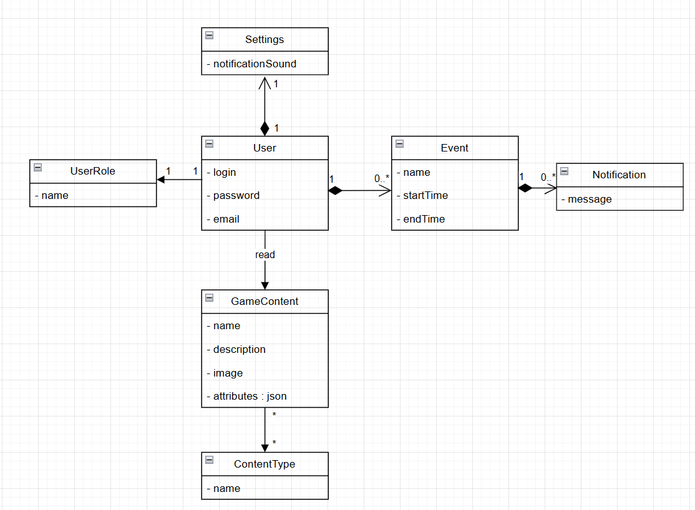

# Domain-model диаграмма

Назначение: структурное представление ключевых понятий и их отношений в предметной области.

Ключевые сущности:
- User
- UserRole
- GameContent
- ContentType
- Event
- Notification
- Settings

