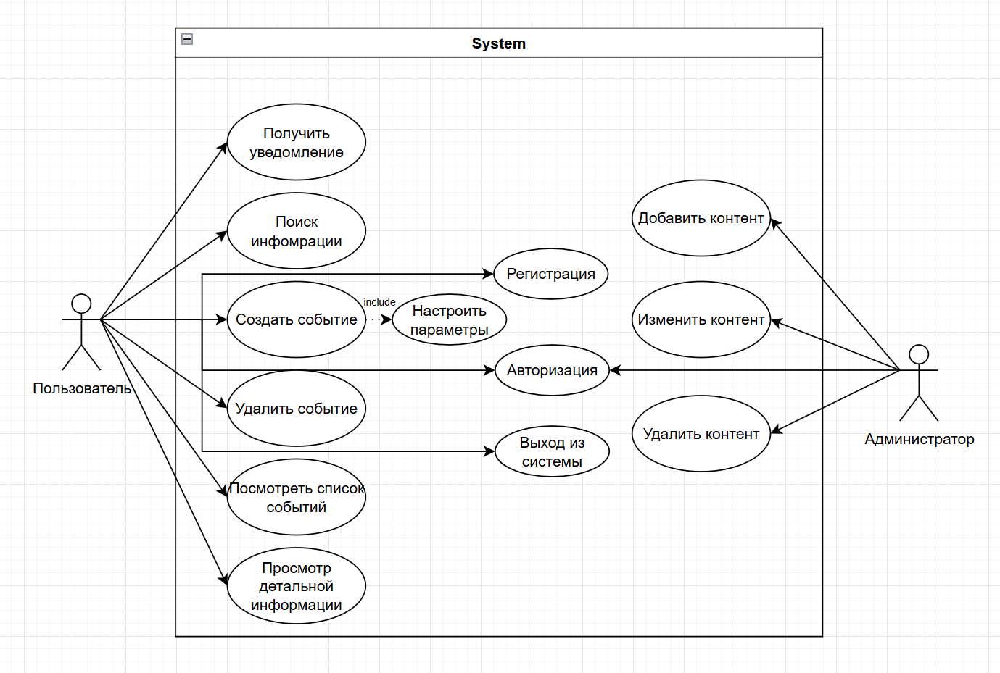

# Use-case диаграмма

Назначение: показать функциональность системы, определить основные функции различных акторов.

Ключевые элементы:
- Акторы:
    - Пользователь
    - Администратор
- Преценденты пользователя:
    - Регистрация
    - Авторизация
    - Выход из системы
    - Поиск информации
    - Просмотр детальной информации
    - Создать событие -> Настроить параметры
    - Удалить событие
    - Посмотреть список событий
    - Получить уведомелние
- Преценденты администратора:
    - Авторизация
    - Добавить контента
    - Изменить контента
    - Удалить контента
    

