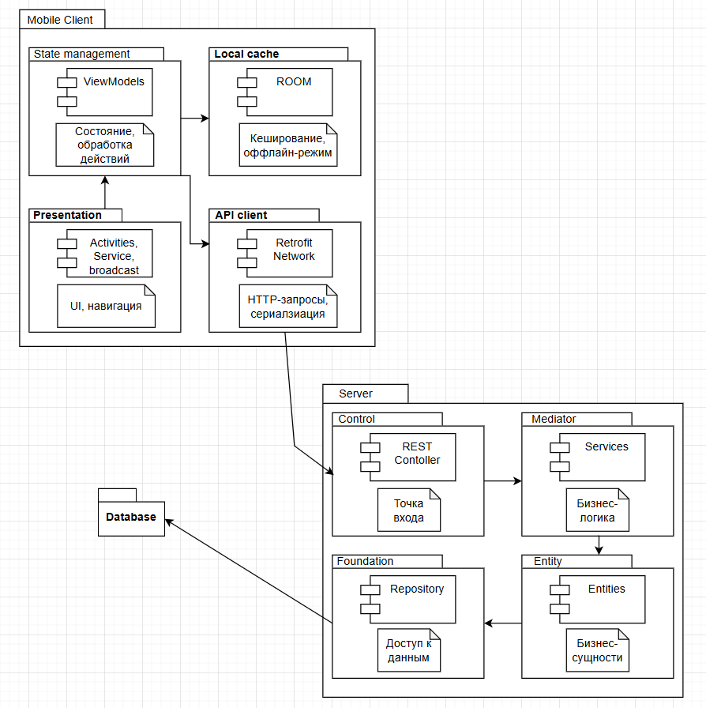

# PCMEF диаграмма

Назначение: организации сложных систем, разбивая их на управляемые группы (пакеты) и отображая зависимости между ними.

Ключевые пакеты в соответствии с выбранной траекторией:
- Mobile Client
    - Presentation
    - State management
    - Local cache
    - API client
- Server
    - Control
    - Mediator
    - Entity
    - Foundation
- Database(Postgre) 

