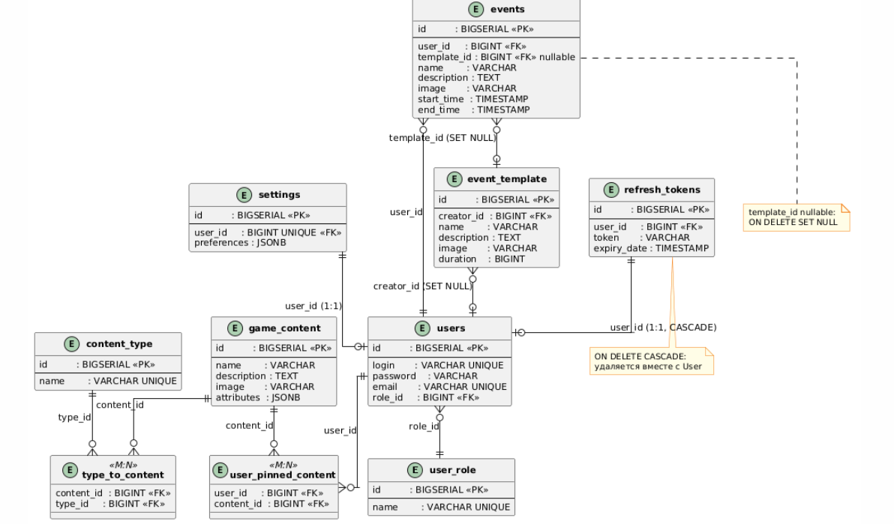

# ER-диаграмма

## Описание

ER-диаграмма (Entity-Relationship) отображает таблицы базы данных PostgreSQL 15, их атрибуты, типы данных и связи между ними. Схема управляется Hibernate (`ddl-auto=update`); данный документ фиксирует итоговую структуру, выводимую из JPA-аннотаций.

---

## Таблицы

### `user_role` — Роли пользователей (справочник)

| Колонка | Тип | Ограничения | Описание |
|---------|-----|------------|---------|
| `id` | `BIGSERIAL` | PK | Идентификатор роли |
| `name` | `VARCHAR` | NOT NULL, UNIQUE | Название роли: `USER`, `ADMIN` |

---

### `users` — Пользователи

| Колонка | Тип | Ограничения | Описание |
|---------|-----|------------|---------|
| `id` | `BIGSERIAL` | PK | Идентификатор пользователя |
| `login` | `VARCHAR` | NOT NULL, UNIQUE | Имя пользователя (логин) |
| `password` | `VARCHAR` | NOT NULL | Хэш пароля (BCrypt) |
| `email` | `VARCHAR` | NOT NULL, UNIQUE | Адрес электронной почты |
| `role_id` | `BIGINT` | NOT NULL, FK → `user_role.id` | Роль пользователя |

---

### `settings` — Персональные настройки

| Колонка | Тип | Ограничения | Описание |
|---------|-----|------------|---------|
| `id` | `BIGSERIAL` | PK | Идентификатор записи |
| `user_id` | `BIGINT` | UNIQUE, FK → `users.id` | Пользователь (1:1) |
| `preferences` | `JSONB` | — | Настройки в свободном формате |

---

### `refresh_tokens` — Refresh-токены JWT

| Колонка | Тип | Ограничения | Описание |
|---------|-----|------------|---------|
| `id` | `BIGSERIAL` | PK | Идентификатор токена |
| `user_id` | `BIGINT` | FK → `users.id` ON DELETE CASCADE | Владелец токена (1:1) |
| `token` | `VARCHAR` | NOT NULL | Значение refresh-токена |
| `expiry_date` | `TIMESTAMP` | NOT NULL | Дата истечения токена |

---

### `content_type` — Типы игрового контента (справочник)

| Колонка | Тип | Ограничения | Описание |
|---------|-----|------------|---------|
| `id` | `BIGSERIAL` | PK | Идентификатор типа |
| `name` | `VARCHAR` | NOT NULL, UNIQUE | Название типа (например: Location, Resource, Recipe) |

---

### `game_content` — Игровой контент

| Колонка | Тип | Ограничения | Описание |
|---------|-----|------------|---------|
| `id` | `BIGSERIAL` | PK | Идентификатор объекта |
| `name` | `VARCHAR` | NOT NULL | Название объекта |
| `description` | `VARCHAR` | — | Описание |
| `image` | `VARCHAR` | — | Путь к изображению |
| `attributes` | `JSONB` | — | Произвольные атрибуты объекта |

---

### `type_to_content` — Связь контент ↔ тип (M:N)

| Колонка | Тип | Ограничения | Описание |
|---------|-----|------------|---------|
| `content_id` | `BIGINT` | PK, FK → `game_content.id` | Ссылка на контент |
| `type_id` | `BIGINT` | PK, FK → `content_type.id` | Ссылка на тип |

---

### `user_pinned_content` — Закреплённый контент пользователя (M:N)

| Колонка | Тип | Ограничения | Описание |
|---------|-----|------------|---------|
| `user_id` | `BIGINT` | PK, FK → `users.id` | Пользователь |
| `content_id` | `BIGINT` | PK, FK → `game_content.id` | Закреплённый объект |

---

### `event_template` — Шаблоны событий

| Колонка | Тип | Ограничения | Описание |
|---------|-----|------------|---------|
| `id` | `BIGSERIAL` | PK | Идентификатор шаблона |
| `creator_id` | `BIGINT` | FK → `users.id` | Создатель шаблона |
| `name` | `VARCHAR` | NOT NULL | Название шаблона |
| `description` | `VARCHAR` | — | Описание |
| `image` | `VARCHAR` | — | Путь к изображению |
| `duration` | `BIGINT` | NOT NULL | Стандартная длительность (секунды) |

---

### `events` — События пользователя

| Колонка | Тип | Ограничения | Описание |
|---------|-----|------------|---------|
| `id` | `BIGSERIAL` | PK | Идентификатор события |
| `user_id` | `BIGINT` | NOT NULL, FK → `users.id` | Владелец события |
| `template_id` | `BIGINT` | FK → `event_template.id` ON DELETE SET NULL | Шаблон (опционально) |
| `name` | `VARCHAR` | NOT NULL | Название события |
| `description` | `VARCHAR` | — | Описание |
| `image` | `VARCHAR` | — | Путь к изображению |
| `start_time` | `TIMESTAMP` | NOT NULL | Время начала отсчёта |
| `end_time` | `TIMESTAMP` | NOT NULL | Время срабатывания уведомления |

---

## Связи между таблицами

| Связь | Тип | Детали |
|-------|-----|-------|
| `users` → `user_role` | N:1 | Каждый пользователь имеет одну роль |
| `settings` → `users` | 1:1 | Одна запись настроек на пользователя |
| `refresh_tokens` → `users` | 1:1 | ON DELETE CASCADE при удалении пользователя |
| `events` → `users` | N:1 | Пользователь владеет множеством событий |
| `events` → `event_template` | N:1 | Событие может быть создано по шаблону (nullable, ON DELETE SET NULL) |
| `event_template` → `users` | N:1 | Шаблон принадлежит создавшему пользователю |
| `game_content` ↔ `content_type` | M:N | Через таблицу `type_to_content` |
| `users` ↔ `game_content` | M:N | Через таблицу `user_pinned_content` |

---

## Диаграмма

> Диаграмма требует обновления: добавить таблицы `refresh_tokens` и `user_pinned_content`; в `events` заменить `trigger_at`/`status` на `start_time`/`end_time`; в `settings` показать `preferences JSONB` вместо отдельных колонок.

PlantUML-исходник: [`diagrams/er-diagram.puml`](./diagrams/er-diagram.puml)
