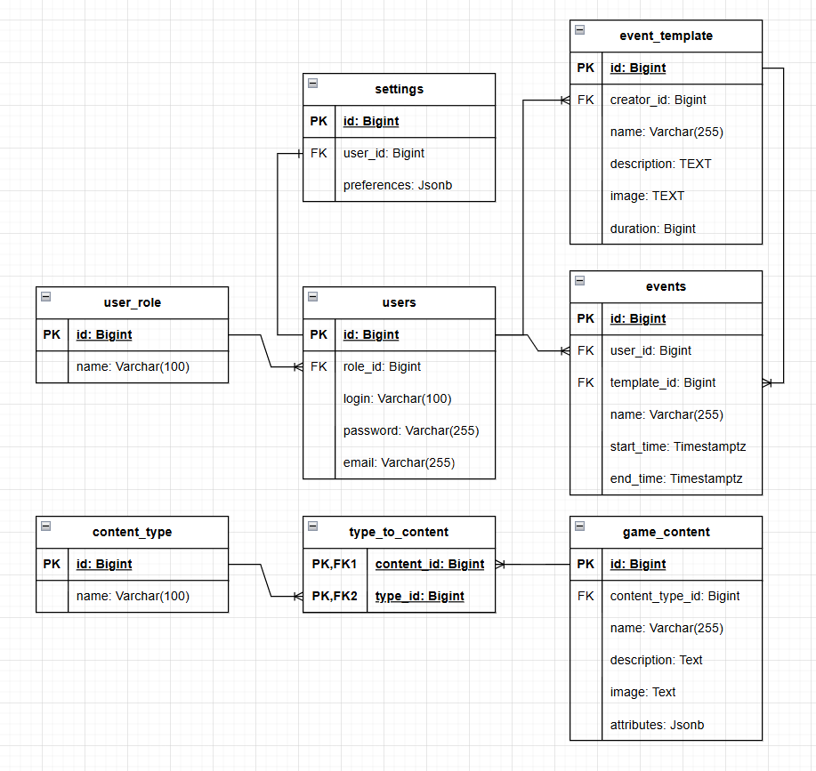

# Entity-Relationship диаграмма

Ключевые таблицы:
- users - таблица пользователей
- user_role - таблица ролей пользователей(справочник)
- settings - таблица настроек пользователей
- events - таблица событий
- game_content - таблица игрового контента
- type_to_content - таблица для реализации связи многие-ко-многим
- content_type - таблица типов контента(справочник)
- event_template - таблица шаблонов событий(Как админский, так и пользовательских)

