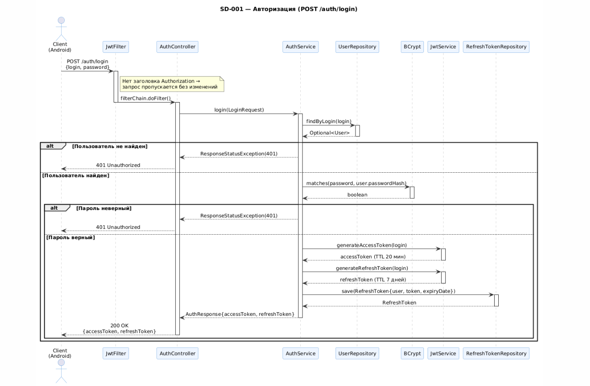
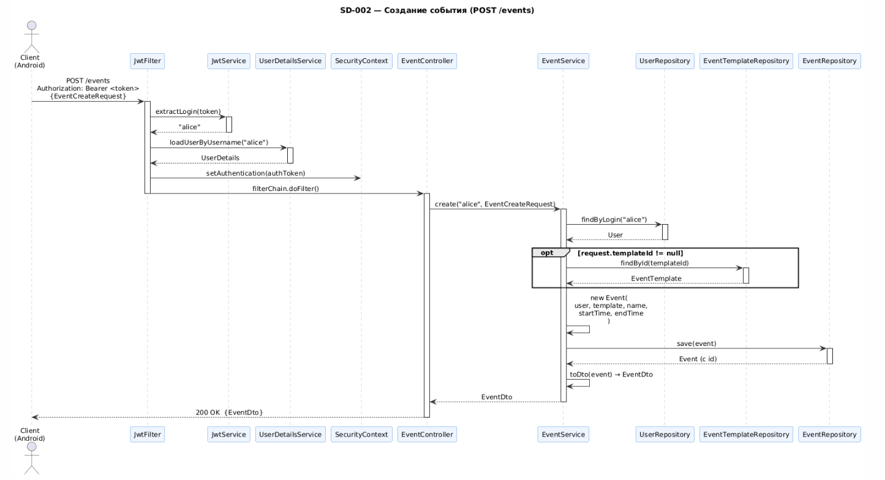
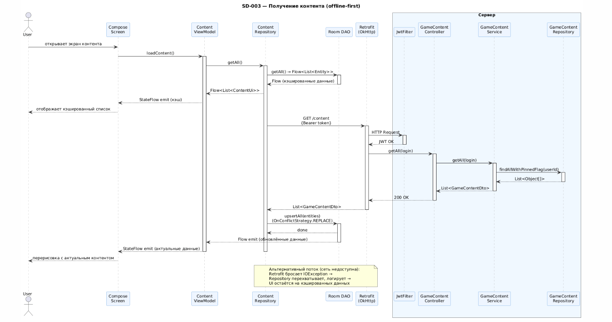

# Диаграммы последовательности

## Описание

Диаграммы последовательности показывают взаимодействие компонентов системы во времени для конкретных сценариев. Описывают порядок вызовов, передаваемые данные и обработку исключений. Охватывают три ключевых сценария: аутентификация, создание события и получение контента в offline-first режиме.

---

## SD-001 — Авторизация (POST /auth/login)

Сценарий демонстрирует прохождение запроса через цепочку Spring Security до возврата JWT-токенов.

### Участники

| Участник | Роль |
|---------|------|
| `Client` | Android-приложение |
| `JwtFilter` | OncePerRequestFilter — проверяет наличие Bearer-токена |
| `AuthController` | REST-контроллер `/auth/login` |
| `AuthService` | Бизнес-логика аутентификации |
| `UserRepository` | Доступ к таблице `users` |
| `BCrypt` | Проверка хэша пароля |
| `JwtService` | Генерация access- и refresh-токенов |
| `RefreshTokenRepository` | Сохранение refresh-токена в БД |

### Диаграмма




### Основной поток

```
1. Client          → POST /auth/login  {login, password}
2. JwtFilter       → нет Bearer-заголовка → пропускает запрос
3. AuthController  → authService.login(request)
4. AuthService     → userRepository.findByLogin(login)
5. UserRepository  → возвращает Optional<User>
6. AuthService     → BCrypt.matches(password, user.password)
7. AuthService     → jwtService.generateAccessToken(login)
8. AuthService     → jwtService.generateRefreshToken(login)
9. AuthService     → refreshTokenRepository.save(refreshToken)
10. AuthController  ← AuthResponse {accessToken, refreshToken}
11. Client          ← 200 OK  {accessToken, refreshToken}
```

### Исключения

| Условие | HTTP-статус | Описание |
|---------|------------|---------|
| Пользователь не найден | 401 Unauthorized | `"Неверный логин или пароль"` |
| Пароль не совпадает | 401 Unauthorized | `"Неверный логин или пароль"` |

---

## SD-002 — Создание события (POST /events)

Сценарий показывает полный путь защищённого запроса: валидация JWT → контроллер → транзакционный сервис → БД.

### Участники

| Участник | Роль |
|---------|------|
| `Client` | Android-приложение |
| `JwtFilter` | Извлекает логин из токена, устанавливает Authentication |
| `JwtService` | Извлекает login из JWT |
| `UserDetailsService` | Загружает UserDetails из БД |
| `SecurityContext` | Хранит текущую аутентификацию |
| `EventController` | REST-контроллер `/events` |
| `EventService` | Бизнес-логика создания события |
| `UserRepository` | Находит владельца события |
| `EventTemplateRepository` | Опционально — находит шаблон |
| `EventRepository` | Сохраняет событие |

### Диаграмма



### Основной поток

```
1. Client          → POST /events  {Authorization: Bearer <token>}  {EventCreateRequest}
2. JwtFilter       → jwtService.extractLogin(token)  → "alice"
3. JwtFilter       → userDetailsService.loadUserByUsername("alice")
4. JwtFilter       → SecurityContext.setAuthentication(authToken)
5. EventController → eventService.create("alice", request)
6. EventService    → userRepository.findByLogin("alice")  → User
7. EventService    → [если request.templateId != null]
                     templateRepository.findById(templateId)  → EventTemplate
8. EventService    → new Event(user, template, name, startTime, endTime)
9. EventService    → eventRepository.save(event)  → Event (с id)
10. EventService   → EventService.toDto(event)  → EventDto
11. EventController ← EventDto
12. Client          ← 200 OK  {EventDto}
```

### Исключения

| Условие | Поведение |
|---------|---------|
| Токен отсутствует или невалиден | JwtFilter пропускает без Authentication → Spring Security возвращает 401 |
| Пользователь не найден в БД | `RuntimeException("User not found")` → 500 |
| Шаблон не найден | `RuntimeException("Template not found: id")` → 500 |

---

## SD-003 — Получение контента, offline-first (GET /content)

Сценарий показывает паттерн offline-first: клиент немедленно отдаёт данные из Room, параллельно запрашивает сервер и обновляет кэш.

### Участники

| Участник | Роль |
|---------|------|
| `ComposeScreen` | UI-слой Jetpack Compose |
| `ContentViewModel` | ViewModel — управляет состоянием экрана |
| `ContentRepository` | Реализация репозитория |
| `Room DAO` | Локальный SQLite-кэш (Room) |
| `Retrofit` | HTTP-клиент (+ OkHttp JWT-интерсептор) |
| `JwtFilter` | Серверная JWT-проверка |
| `GameContentController` | REST-контроллер `/content` |
| `GameContentService` | Бизнес-логика контента |
| `GameContentRepository` | Доступ к таблице `game_content` |

### Диаграмма



### Основной поток (сеть доступна)

```
1. ComposeScreen    → viewModel.loadContent()
2. ContentViewModel → repository.getAll()
3. ContentRepository → roomDao.getAll()          ← Flow<List<Entity>> (мгновенно)
4. ContentViewModel ← Flow (кэшированные данные) → UI обновляется
5. ContentRepository → retrofit.getAll()         (асинхронно, suspend)
6. Retrofit         → GET /content  {Bearer token}
7. JwtFilter        → validateToken → OK
8. GameContentController → gameContentService.getAll(login)
9. GameContentService  → gameContentRepository.findAllWithPinnedFlag(userId)
10. GameContentController ← List<GameContentDto>
11. Retrofit         ← List<GameContentDto>
12. ContentRepository  → roomDao.upsertAll(entities)   (REPLACE стратегия)
13. Room             → emits new Flow value
14. ContentViewModel ← обновлённый List
15. ComposeScreen   → recompose с актуальными данными
```

### Альтернативный поток (сеть недоступна)

```
1–4.  Те же шаги — UI показывает кэш из Room
5.    ContentRepository → retrofit.getAll() → IOException / timeout
6.    ContentRepository → логирует ошибку, не бросает исключение
7.    UI остаётся на кэшированных данных
```
