# Этап 8 — Интерфейс пользователя

## Описание

Документ содержит скриншоты пользовательского интерфейса мобильного клиента LDOE-Helper (Android, Jetpack Compose). Интерфейс разделён на пять основных экранов, доступных через нижнюю навигационную панель, модальные окна и наложенный overlay-виджет.

---

## Навигация

Основная навигация реализована через `BottomAppBar` с пятью маршрутами:

| Маршрут | Экран | Описание |
|---------|-------|---------|
| `Home` | Главная | Ближайшие события и закреплённый контент |
| `Events` | События | Список всех событий пользователя |
| `Templates` | Шаблоны | Шаблоны событий |
| `Database` | База знаний | Игровой контент с фильтрацией по типам |
| `Settings` | Настройки | Профиль, авторизация, смена пароля |

---

## Основные экраны

### Главная (Home)

Отображает ближайшие активные события и закреплённый пользователем игровой контент.

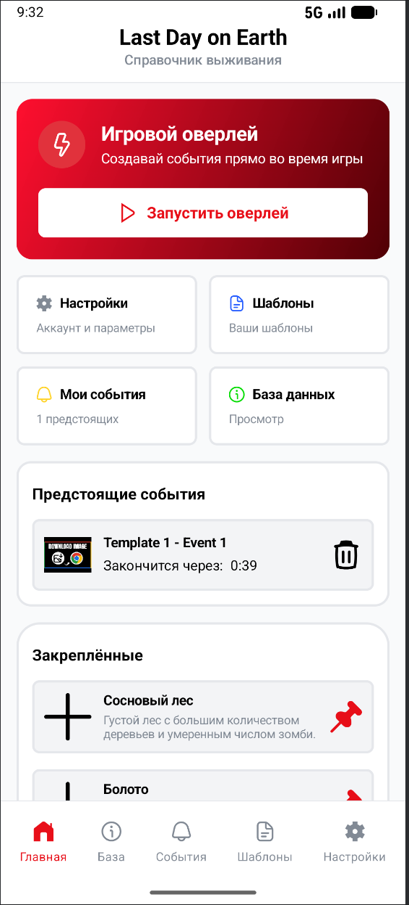

---

### События (Events)

Список всех событий пользователя с таймером обратного отсчёта. Поддерживает создание, просмотр и удаление.

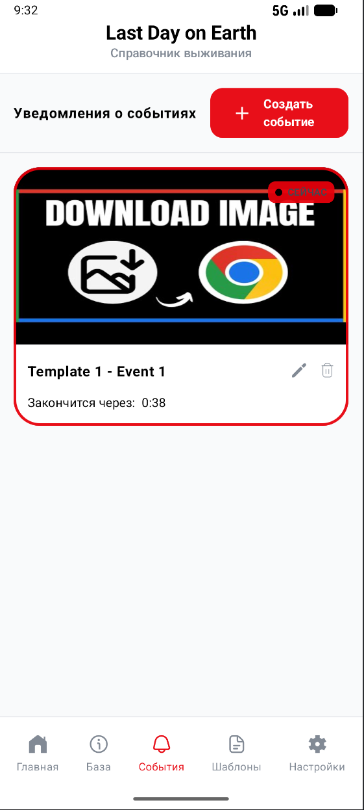

---

### Шаблоны (Templates)

Список шаблонов событий. Шаблон задаёт имя и длительность — при создании события выбранный шаблон автоматически заполняет поля.

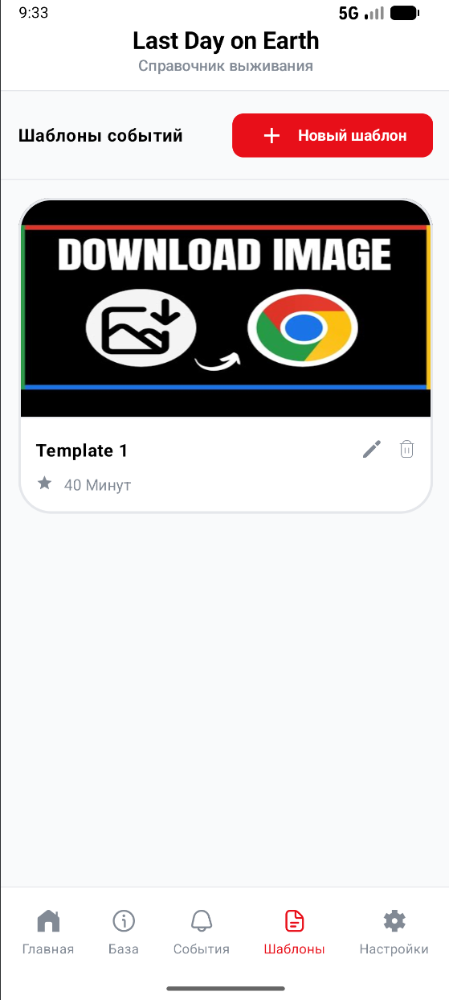

---

### База знаний (Database / Info)

Игровой контент, сгруппированный по типам. Поддерживает фильтрацию по категориям и закрепление элементов.

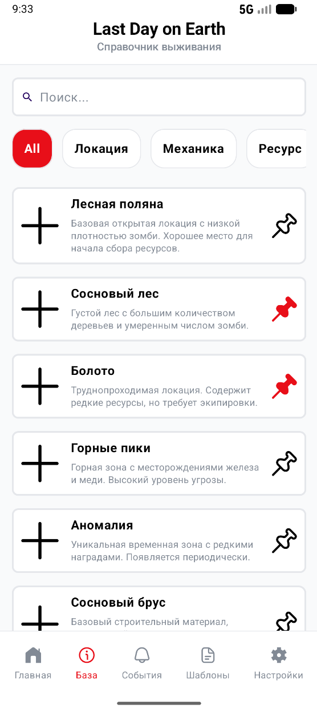

---

### Настройки (Settings)

Управление профилем пользователя. Содержит формы входа, регистрации, редактирования профиля и смены пароля в зависимости от состояния авторизации.

#### Авторизация

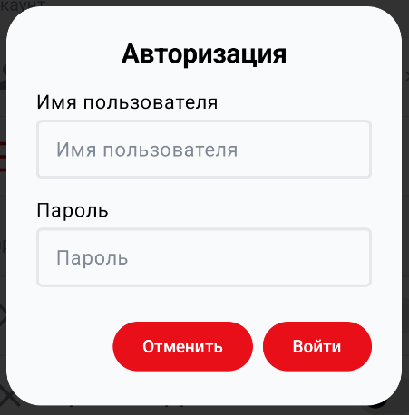

#### Профиль

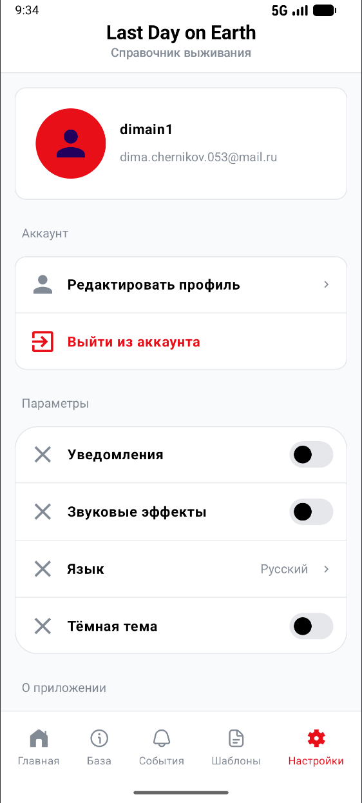

---

## Модальные окна

### Создание события

Форма создания события: название, описание, дата и время начала/окончания, выбор шаблона. При выборе шаблона время окончания рассчитывается автоматически.

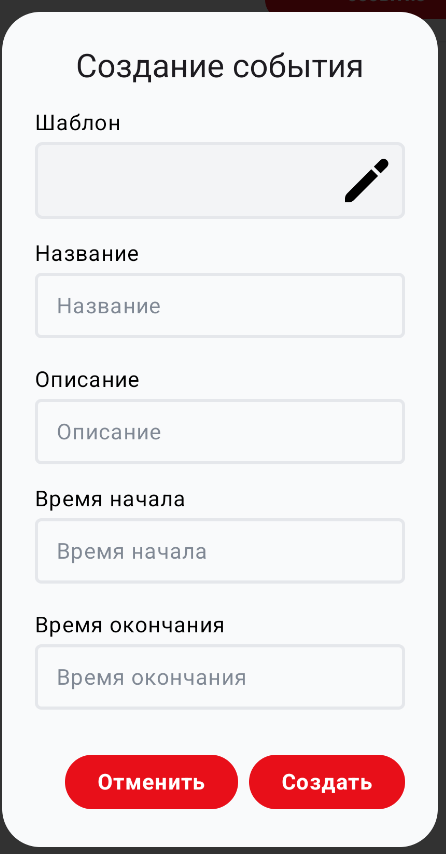

---

### Просмотр события

Детальный вид события с полными данными и таймером.

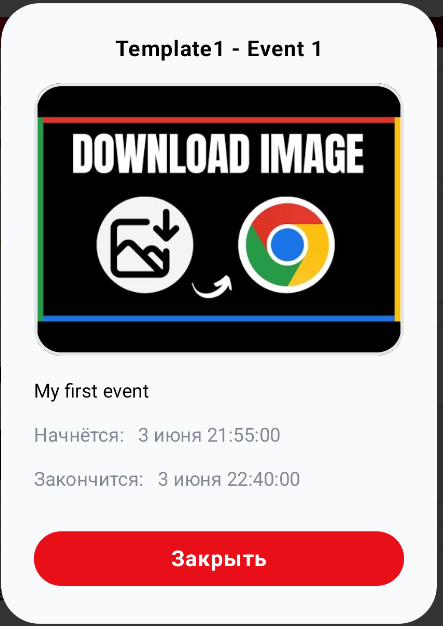

---

### Создание шаблона

Форма создания шаблона: название, описание, длительность, изображение.

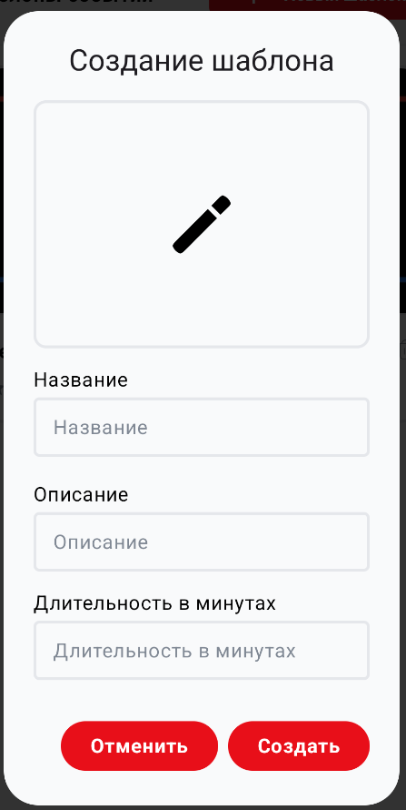

---

### Просмотр шаблона

Детальный вид шаблона.

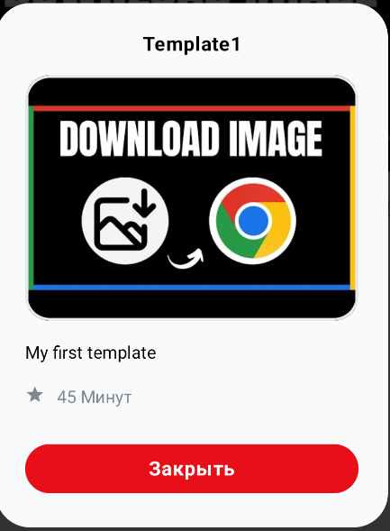

---

### Просмотр игрового контента

Детальный вид элемента базы знаний с атрибутами и изображением.

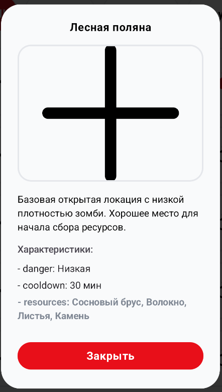

---

## Overlay-виджет

Плавающий виджет, отображаемый поверх других приложений через `OverlayService`. Позволяет работать с событиями не выходя из игры.

### Меню

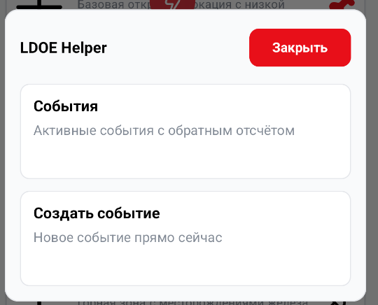

---

### Список событий

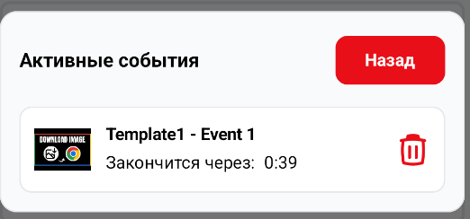

---

### Создание события

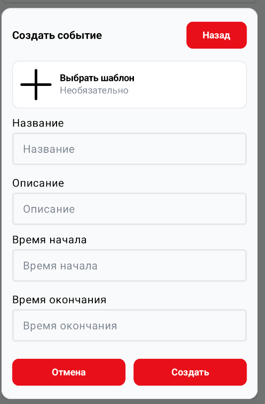
