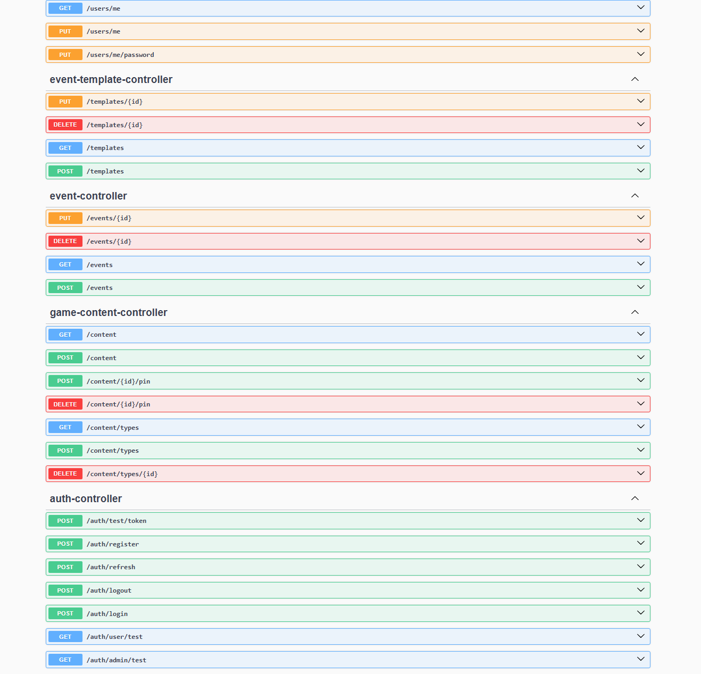

# Руководство администратора — LDOE-Helper

## О роли администратора

Администратор системы управляет игровым контентом (база знаний), типами контента и обслуживает серверную инфраструктуру. В части работы с мобильным приложением администратор обладает всеми правами обычного пользователя.

**Получение роли администратора:** первый зарегистрированный в системе пользователь автоматически получает роль `ADMIN`. Все последующие регистрации создают пользователей с ролью `USER`.

---

## 1. Управление игровым контентом

Создание и удаление контента выполняется через REST API серверной части. Удобнее всего использовать встроенный **Swagger UI**.

### 1.1 Доступ к Swagger UI

1. Убедитесь, что сервер запущен (`docker-compose up -d`)
2. Откройте в браузере: `http://localhost:8080/swagger-ui.html`
3. Авторизуйтесь: нажмите **«Authorize»**, введите Bearer-токен

**Получение токена:**
```
POST http://localhost:8080/auth/login
Body: { "login": "your_login", "password": "your_password" }
```

Скопируйте `accessToken` из ответа и вставьте в поле авторизации Swagger в формате: `Bearer eyJhbGci...`



---

### 1.2 Типы контента

Типы (категории) контента позволяют фильтровать объекты в базе знаний. Тип `"All"` создаётся автоматически при старте сервера и не может быть удалён.

#### Создать тип контента

```
POST /content/types
Authorization: Bearer <admin_token>
Content-Type: application/json

{
  "name": "Weapons"
}
```

Ответ:
```json
{ "id": 2, "name": "Weapons" }
```

#### Получить все типы

```
GET /content/types
Authorization: Bearer <token>
```

#### Удалить тип

```
DELETE /content/types/{id}
Authorization: Bearer <admin_token>
```

> Удаление типа `"All"` запрещено — сервер вернёт ошибку.  
> При удалении типа контент, привязанный к нему, сохраняется, но теряет данную категорию.

---

### 1.3 Создание игрового контента

Запрос типа `multipart/form-data`. Поле `request` — JSON с данными объекта, поле `file` — изображение (необязательно, максимум 5 МБ).

#### Через Swagger UI

1. Откройте раздел **Content → POST /content**
2. Нажмите **«Try it out»**
3. Заполните поле `request`:

```json
{
  "name": "АК-74",
  "description": "Штурмовая винтовка",
  "typeIds": [2, 3],
  "attributes": {
    "damage": 42,
    "durability": 100,
    "ammo": "7.62"
  }
}
```

4. При необходимости загрузите изображение в поле `file`
5. Нажмите **«Execute»**

#### Через curl

```bash
curl -X POST http://localhost:8080/content \
  -H "Authorization: Bearer <admin_token>" \
  -F 'request={"name":"АК-74","description":"Описание","typeIds":[2],"attributes":{"damage":42}};type=application/json' \
  -F "file=@/path/to/image.png"
```

**Структура поля `attributes`:** произвольный JSON-объект. Можно добавлять любые характеристики без изменения схемы БД — данные хранятся в JSONB-колонке.

---

### 1.4 Схема объекта контента

| Поле | Тип | Обязательное | Описание |
|------|-----|:---:|---------|
| `name` | string | ✅ | Название объекта |
| `description` | string | ❌ | Текстовое описание |
| `typeIds` | array[long] | ❌ | ID категорий; тип `"All"` добавляется автоматически |
| `attributes` | object | ❌ | Произвольные атрибуты (JSONB) |
| `file` | multipart | ❌ | Изображение (JPG, PNG, max 5 МБ) |

---

## 2. Обслуживание сервера

### 2.1 Запуск системы

```bash
# В корне проекта
cd "Курсовая работа 3 курс"

# Сборка JAR (после изменений кода)
cd Backend/backend
./gradlew bootJar
cd ../..

# Запуск всех сервисов
docker-compose up --build -d
```

Проверка статуса:
```bash
docker-compose ps
```

Ожидаемый результат — оба контейнера в состоянии `running (healthy)`:

```
NAME           STATUS
ldoe-db        Up (healthy)
ldoe-backend   Up
```

### 2.2 Просмотр логов

```bash
# Все логи backend
docker logs ldoe-backend

# Следить за логами в реальном времени
docker logs ldoe-backend -f

# Логи базы данных
docker logs ldoe-db
```

### 2.3 Перезапуск сервисов

```bash
# Перезапустить только backend (например, после пересборки JAR)
docker-compose restart backend

# Полный перезапуск
docker-compose down
docker-compose up -d
```

### 2.4 Остановка системы

```bash
# Остановить контейнеры (данные БД сохраняются в volume pgdata)
docker-compose down

# Полный сброс, включая данные БД (необратимо!)
docker-compose down -v
```

---

## 3. Конфигурация

Все параметры системы задаются в файле `.env` в корне проекта.

### 3.1 Описание параметров

| Параметр | Значение по умолчанию | Описание |
|---------|----------------------|---------|
| `DB_NAME` | `LDOE_helper` | Имя базы данных PostgreSQL |
| `DB_USERNAME` | `test_role` | Пользователь БД |
| `DB_PASSWORD` | `admin` | Пароль пользователя БД |
| `DB_PORT` | `5432` | Порт PostgreSQL |
| `SERVER_PORT` | `8080` | Порт API-сервера |
| `JWT_SECRET` | *(см. .env)* | Секрет подписи JWT. **Обязательно смените перед продакшн-деплоем!** Минимум 32 символа |
| `JWT_ACCESS_EXPIRATION_MS` | `1200000` | Время жизни access-токена (20 минут) |
| `JWT_REFRESH_EXPIRATION_MS` | `604800000` | Время жизни refresh-токена (7 дней) |

### 3.2 Изменение конфигурации

1. Отредактируйте `.env`
2. Перезапустите контейнеры:
   ```bash
   docker-compose down
   docker-compose up -d
   ```

> **Важно:** при смене `DB_USERNAME` или `DB_PASSWORD` необходимо также удалить том `pgdata` и пересоздать БД, либо вручную изменить права в PostgreSQL.

---

## 4. Резервное копирование базы данных

### 4.1 Создание резервной копии

```bash
docker exec ldoe-db pg_dump -U test_role LDOE_helper > backup_$(date +%Y%m%d).sql
```

### 4.2 Восстановление из резервной копии

```bash
# Убедитесь, что БД запущена и пуста
docker exec -i ldoe-db psql -U test_role -d LDOE_helper < backup_20260604.sql
```

---

## 5. Работа с изображениями

Загруженные через API изображения хранятся в Docker-томе `uploads`, смонтированном в контейнере по пути `/app/uploads`.

Изображения доступны по URL: `http://localhost:8080/images/{filename}`

### Просмотр содержимого тома

```bash
docker exec ldoe-backend ls /app/uploads
```

### Резервное копирование изображений

```bash
docker cp ldoe-backend:/app/uploads ./uploads_backup
```

---

## 6. Мониторинг и диагностика

### Проверка здоровья БД

```bash
docker exec ldoe-db pg_isready -U test_role -d LDOE_helper
```

### Подключение к PostgreSQL напрямую

```bash
docker exec -it ldoe-db psql -U test_role -d LDOE_helper
```

Полезные SQL-запросы:

```sql
-- Количество пользователей
SELECT COUNT(*) FROM users;

-- Список пользователей с ролями
SELECT u.login, u.email, r.name AS role
FROM users u JOIN user_role r ON u.role_id = r.id;

-- Количество объектов в базе знаний
SELECT COUNT(*) FROM game_content;

-- Активные refresh-токены
SELECT u.login, rt.expiry_date
FROM refresh_tokens rt JOIN users u ON rt.user_id = u.id;
```

### Частые проблемы

| Симптом | Вероятная причина | Решение |
|---------|-----------------|---------|
| `ldoe-backend` не стартует | JAR не собран или устарел | `./gradlew bootJar` и `docker-compose up --build -d backend` |
| Ошибка подключения к БД | `ldoe-db` не готов | Подождать 10–15 сек; проверить `docker-compose ps` |
| `duplicate key` при входе | Баг refresh-токена (исправлен) | Убедитесь, что используется актуальная версия кода |
| Изображение не отображается | Файл не в папке `uploads` или неверный путь | Проверить `docker exec ldoe-backend ls /app/uploads` |
